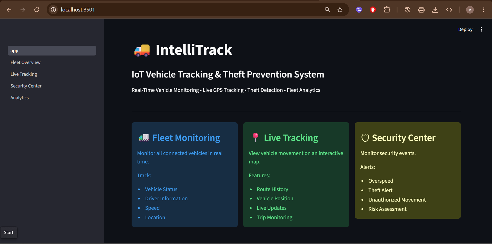
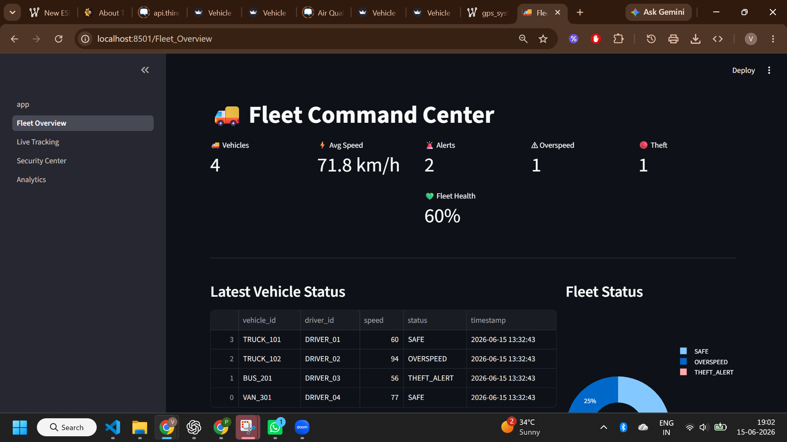
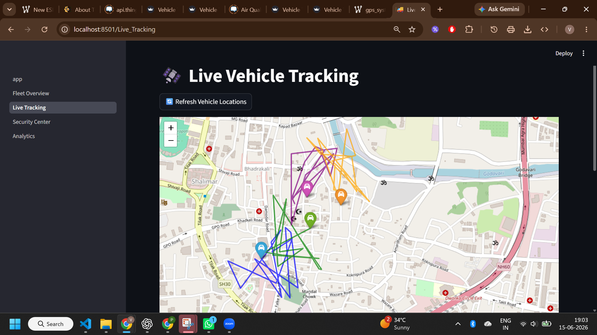
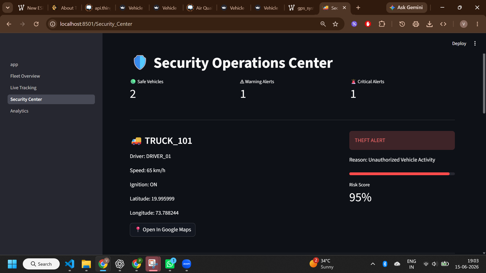
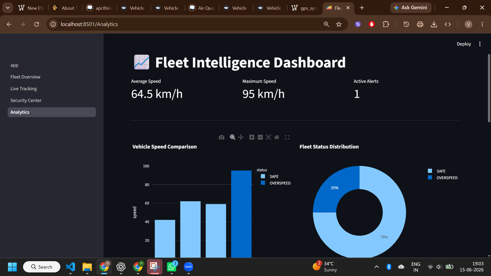
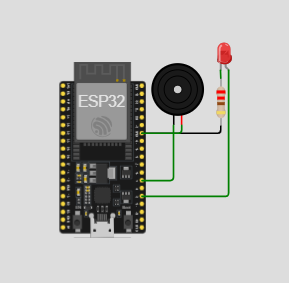
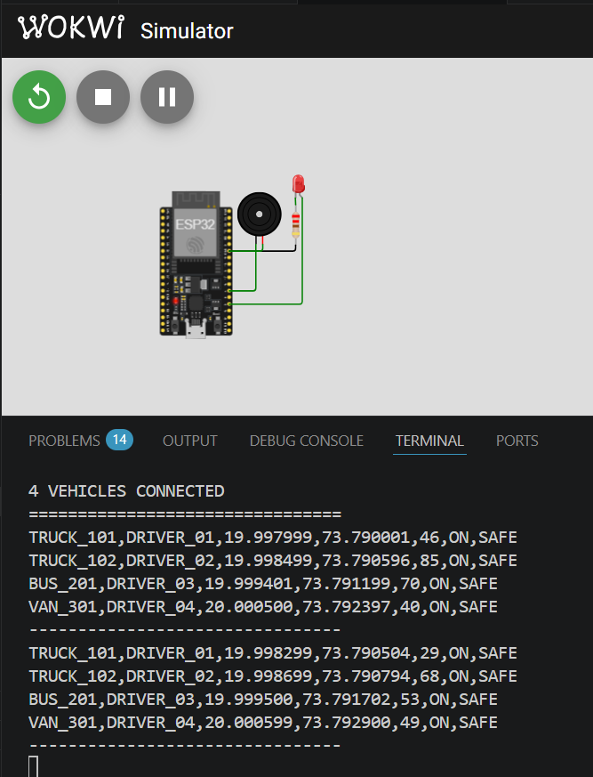

# 🚚 IntelliTrack – IoT Vehicle Tracking & Theft Prevention System

## Live Demo

Streamlit App:
https://intellitrack-iot-vehicle-tracking-system-dub6dyy9aruqp3jwfs23e.streamlit.app/


## 📌 Overview

IntelliTrack is an IoT-based Vehicle Tracking & Theft Prevention System designed to monitor fleet vehicles in real time.

The system simulates ESP32-based vehicle tracking and provides:

- Real-Time Vehicle Monitoring
- Live GPS Tracking
- Route Visualization
- Overspeed Detection
- Theft Alert Detection
- Fleet Analytics Dashboard
- Security Monitoring Center
- Multi-Vehicle Fleet Management

---

## 🚀 Features

### 📍 Live Vehicle Tracking
- Real-time vehicle location updates
- Route visualization on interactive maps
- Vehicle-wise tracking

### 🚨 Security Center
- Overspeed alerts
- Theft alerts
- Vehicle risk monitoring
- Driver monitoring

### 📊 Fleet Analytics
- Speed analysis
- Fleet status monitoring
- Vehicle performance insights
- Interactive charts and dashboards

### 🚚 Fleet Management
- Multiple vehicle monitoring
- Driver assignment tracking
- Live fleet status

---

## 🏗️ System Architecture

ESP32 Simulator (Wokwi)
↓
Python Data Receiver
↓
SQLite Database
↓
Streamlit Dashboard
↓
Analytics & Security Monitoring

---

## 🛠️ Tech Stack

### Hardware
- ESP32 (Simulated using Wokwi)

### Backend
- Python
- SQLite

### Dashboard
- Streamlit
- Plotly
- Folium

### IoT Simulation
- PlatformIO
- Wokwi

---

## 📂 Project Structure

```text
IntelliTrack-IoT-Vehicle-Tracking-System/
│
├── backend/
│   ├── database.py
│   └── serial_receiver.py
│
├── dashboard/
│   ├── app.py
│   └── pages/
│       ├── 1_Fleet_Overview.py
│       ├── 2_Live_Tracking.py
│       ├── 3_Security_Center.py
│       └── 4_Analytics.py
│
├── database/
│   └── vehicle_tracking.db
│
├── esp32/
│   ├── src/
│   │   └── main.cpp
│   ├── platformio.ini
│   └── diagram.json
│
├── images/
│
├── requirements.txt
│
└── README.md
```

---

# 📸 Project Screenshots

## 🏠 Home Page



---

## 🚚 Fleet Overview



---

## 📍 Live Tracking Dashboard



---

## 🚨 Security Center



---

## 📊 Analytics Dashboard



---

# 🔌 Circuit Diagram

ESP32 Vehicle Tracking Simulator Circuit



---

# 💻 ESP32 Serial Output

Real-time telemetry generated by ESP32 simulator.



Example Output:

```text
================================
AI VEHICLE TRACKING SYSTEM
ESP32 STARTED
================================

TRUCK_101,DRIVER_01,19.997999,73.790306,57,ON,SAFE
TRUCK_102,DRIVER_02,19.998499,73.790810,29,ON,SAFE
BUS_201,DRIVER_03,19.998999,73.791313,32,ON,SAFE
VAN_301,DRIVER_04,19.999498,73.791817,34,ON,SAFE
```

---

## ⚙️ Installation

### Clone Repository

```bash
git clone https://github.com/varda24/IntelliTrack-IoT-Vehicle-Tracking-System.git
```

### Install Dependencies

```bash
pip install -r requirements.txt
```

### Start Simulator

```bash
python backend/serial_receiver.py
```

### Launch Dashboard

```bash
streamlit run dashboard/app.py
```

---

## 🎯 Future Enhancements

- Real GPS Integration
- MQTT Communication
- Node-RED Dashboard
- Email Alerts
- SMS Notifications
- AI-Based Anomaly Detection
- Cloud Deployment
- Mobile Application

---

## 👨‍💻 Author

Varda Kunde

---

## ⭐ Support

If you found this project useful, consider giving it a star on GitHub.
